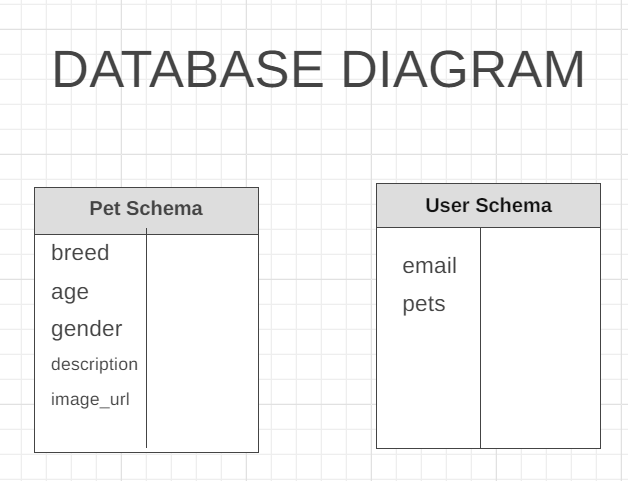

# Nimnim-adopt

## Falcon Team:

1. Saleh Abu Radwan.
1. Mohammad Noor
1. Miral Al-Abduallah
1. Samer Odeh.
1. Rawan Al-khasawneh.
1. Mahmoud Salameh.
1. Shahd Jalam.

## Conflict Plan

As a team, we will try to keep our relationships as strong as possible. If we encounter a conflict, we will first try to resolve it amongst ourselves before informing the Team-Leader about it. If this conflict cannot be resolved, we will notify the instructional team, who will assist us in resolving it.

## Communication Plan

We discussed as a group the time we would like to work in:

During class, we decided to go to the Zoom breakout room and work as much as we could.
After that, we can take a break before returning to our work. We chose a two-hour break.
Friday is a day off for us, so we take it off and rest.

## Work Plan

1. How you will identify tasks, assign tasks, know when they are complete, and manage work in general?

We will assign the frondend part React app of our website to four of our team members, and we have decided to solve the backend part NodeJS with other team member in order to solve them faster than individually, and we will keep everyone up to date on the slack channel.

1. What project management tool will be used?

- We will divide the tasks using Trello, and each member will have a separate branch on github to work on before the merge.

## Git Process

We created an organization and a repo within it on github to save our code and added all team members to it so that we can all push our work and do a pull request and merge after the team leader checks that there is no conflict in the branch.

## Wireframe

## DataBase Diagram

